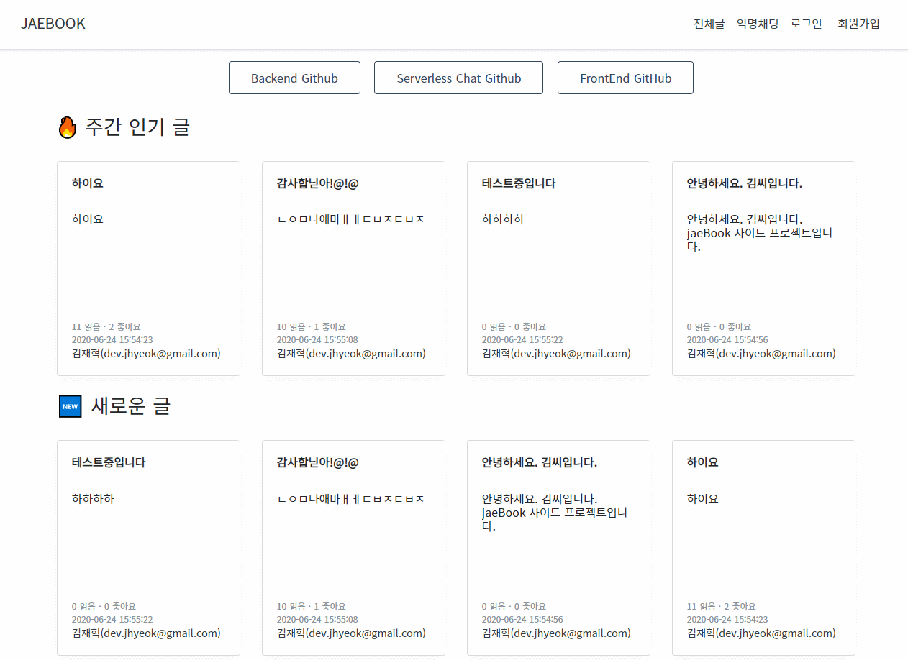
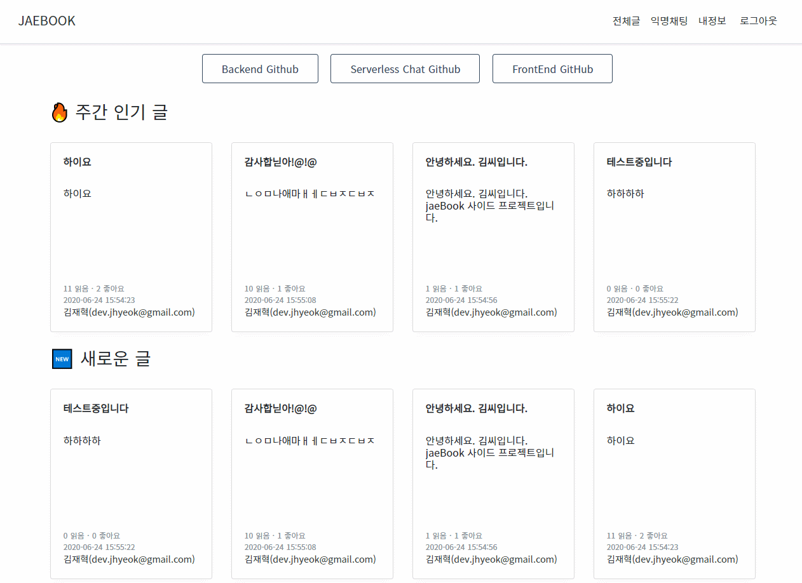
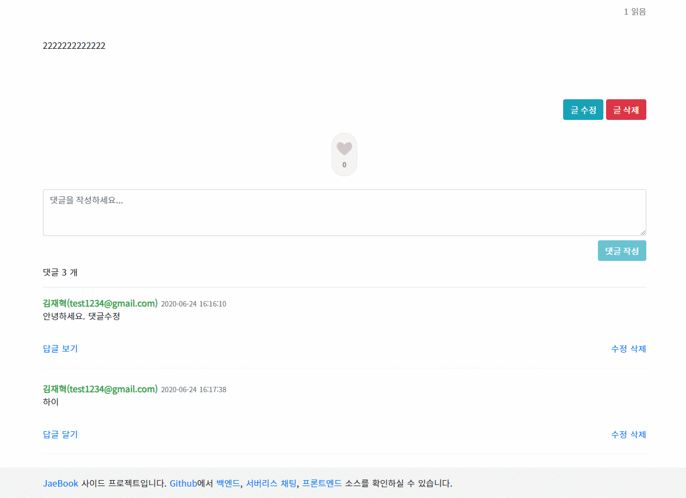
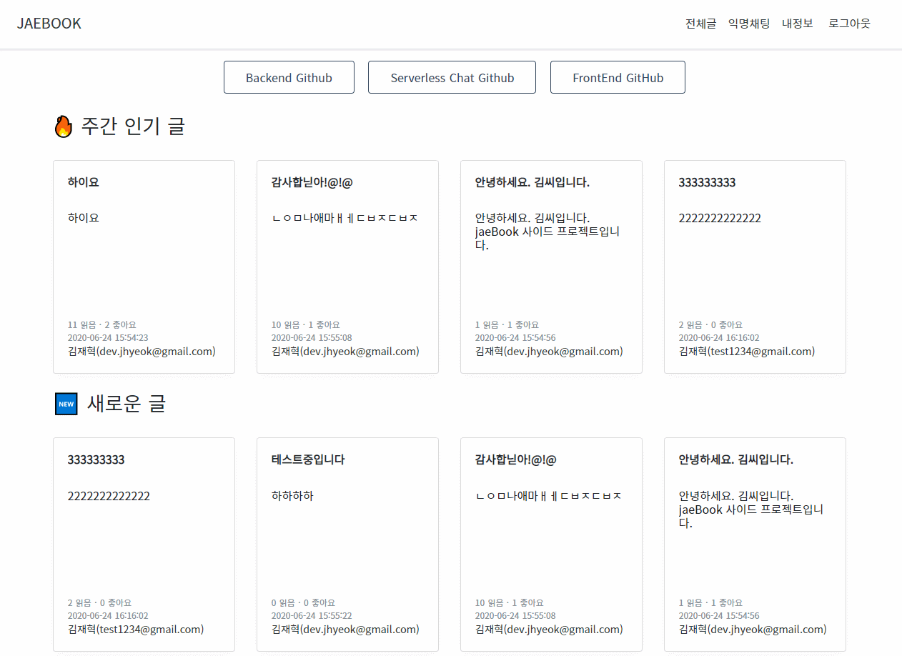

# ❯ JaeBook Client

JaeBook 개인 프로젝트의 Front 입니다.

## 로그인 및 회원가입

> vee-validate을 사용해서 유효성 검사를 합니다.

> 회원가입이 완료되면 바로 로그인이 됩니다.

> JWT 기반이며, AccessToken을 인증에 사용하며 RefreshToken을 사용해서 AccessToken을 재발급받습니다.



## 새 글 작성 및 수정과 삭제

> 글을 작성하고 작성자는 수정과 삭제를 할 수 있습니다.



## 댓글과 답글

> 댓글을 달 수 있고 답글을 달 수 있습니다.

> 답글이 없는 댓글은 '답글 달기'라는 버튼이 보이며, 답글이 달려 있는 댓글은 '답글 보기'라는 버튼이 보입니다.

> 댓글의 개수는 댓글과 답글의 합계이며, 삭제된 댓글은 계산하지 않습니다.

> 새로운 댓글을 작성하면 작성된 댓글로 스크롤링합니다. 수정하는 댓글도 마찬가지입니다.



## 내 정보 및 다른 사용자의 정보

> 내 정보에서는 내 정보를 확인하고 수정할 수 있습니다.

> 작성한 글과 댓글을 확인하고 해당 게시글로 이동할 수 있습니다.

> 다른 사용자의 정보도 확인할 수 있으며 작성한 글과 댓글을 확인할 수 있습니다.



## 익명채팅

> 익명 닉네임을 부여하며 채팅을 할 수 있습니다.

> 다른 페이지를 갔다 오거나 새로 들어온 사용자도 이전의 채팅 내용을 확인할 수 있습니다.


## 글 무한 스크롤

> 페이지 번호를 누르는 방식이 아닌 스크롤을 내려서 다음 글을 확인할 수 있습니다.


## 글 좋아요

> 작성된 글은 좋아요를 누를 수 있으며, 조회수와 좋아요의 수를 계산해서 주간 인기글을 선정해서 보여줍니다.


## TechStack

- **Nuxt.js**
- **TypeScript**
- **ESLint, Prettier**

## Build Setup

``` bash
# install dependencies
$ yarn install

# serve with hot reload at localhost:5000
$ yarn dev

# build for production and launch server
$ yarn build
$ yarn start
```
